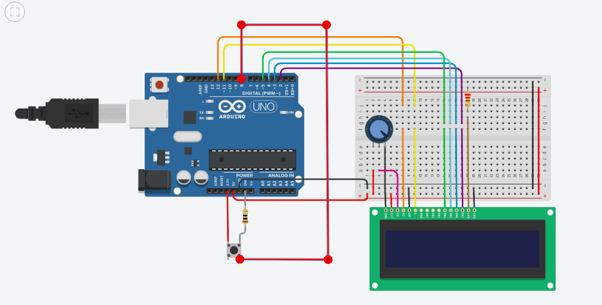
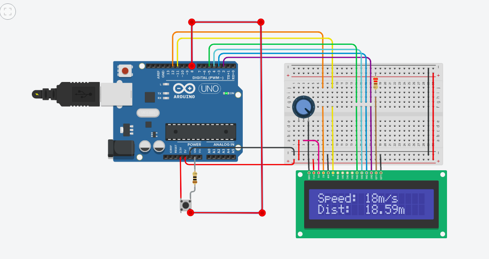
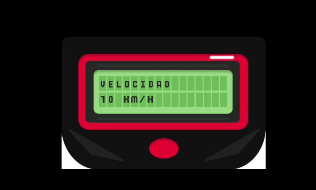

# Bike-speedometer
Este es un proyecto que determina la velocidad de una bicicleta usando un interruptor.El interruptor devuelve el tiempo que tardó la bicicleta en hacer una rotación completa y luego coloca ese valor sobre la circunferencia que devuelve la velocidad.:grinning: 

 ### Circuito Speedometer en TINKERCAD
 
 
 
 
 
 
 
 
 
 
 
 
Un arduino conectado a una pantalla LCD de 16x2 donde se mostrará la velocidad y la distancia recorrida.
Mediante un botón simulamos la señal digital del sensor hall.
Al mandar dos señales calculamos el tiempo entre ellas, en base a eso y usando el perímetro de la llanta de la bicicleta, establecemos la velocidad promedio  que tuvo durante todo ese giro, para así presentarla en pantalla.
Por cada señal recibida por parte del botón aumenta la distancia recorrida en un perímetro.
 
 ### Materiales para el circuito
Componentes | Precio | Cantidad |
| ------------- | ------------- | ------------- |
| Arduino UNO R3  | $30 | 1 |
| Sensor Hall y módulo  | $3  | 1 |
| Breadboard Pequeña  | $3 | 1 |
| Potenciometro  | $2  | 1 |
| Resistencia de 10 ohmio | $1 | 1 |
| Resistencia de 220 ohmio | $1  | 1 |
| LCD 16x2 | $6 | 1 |
| Cables macho-macho | $0.10 | 10 |

### Prototipo
Para este proyecto se realizo una simulación de como se vería la parte externa del velocimetro para la bicicleta en figma.Este prototipo posee un boton rojo para apagar y prender el dispositivo. La idea incial era presentar en la pantalla LCD solo la velocidad en km/h pero finalmente en el circuito se decidio presentar tanto la distancia en m y la velocidad en m/s. 

